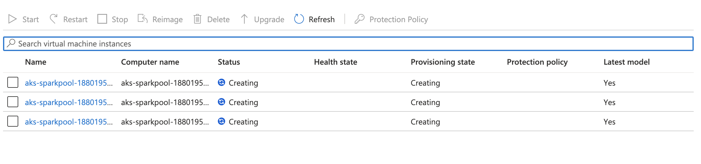

# jupyterhub-k8s-apache-spark
Deploy Apache Spark in client mode on Kubernetes cluster. 
Allow user to interact the Spark cluster with Jupyter notebook. 
Serve Jupyter Notebooks through Jupyterhub server. 
Manage dependencies with docker images.

# Infrastructure
Choose the cloud provider and set up the cloud infrastructure. Below is a list of required services. Note that one can optinally build all infrastructure on premises.  

1. virtual network
2. kubernetes cluster. 
3. container registery
4. storage account
5. service principle or cloud service account

For demonstration purpose, azure.sh includes all commands one might need to set up infrastructure in the Azure environment. 

## Environment variables
The following environment variables are needed to pre-define in the dev environment. 

```txt
    TENANT_ID=<your_tenant_id>
    SERVICE_PRINCIPLE_ID=<your_service_principle_id>
    SERVICE_PRINCIPLE_SECRET=<your_service_principle_secret>
    ADLS_ACCOUNT_NAME=<adls_account_name>
    ADLS_ACCOUNT_KEY=<adls_account_sharekey>
    RESOURCE_GROUP=JHUB-SPARK
    VNET_NAME=AKS-VNET
    ACR_NAME=jhubsparkacr
    AKS_NAME=jhubsparkaks
    AKS_VERSION=1.22.6
    JHUB_NAMESPACE=jhubspark-jhub
    BASE_IMAGE=justmodeling/spark-py39:v3.2.1
    SPARK_NDOE_POOL=sparkpool
    ACR_PULL_SECRET=jhubsparkacr-secret
    SERVICE_ACCOUNT=spark-admin
    USER_FS=test-jhub-user
    PROJECT_FS=test-jhub-project
```

One can play all of these in txt file "env" and export them at once

```bash
set -a
. ./credentials/env
set +a
```

## Kubernetes cluster management
It is always a good practice to segment pods by their functionality and assign them to the dedicated node pool to maximize the performance and minimize the cost. 

In my case, I set up four node pools as following:
* **systempool**. This is where the Kubernetes scheduler pod and api-server pod are assigned to. No other pod can be scheduled on this node pool and it does not scale up automatically.

* **apppool**. This is the node pool for application pods, such as JupyterHub. They are most likely to be deployed through Helm. This node pool can scale up automatically depends on the usage.

* **jhubuserpool**. This node pool mainly host the single-user pod for JupyterHub. When users arrive to login and spawn their own workspace, each of them will have a pod to run their notebook server. These pods are created by JupyterHub so they are assign on this dedicated pool. This pool can autoscale and has more memory and compute resources as it is where user might conduct heavy algorithm computing or data manipulation. When there is no user, this pool can scale down to 0 node automatically. 

* **sparkpool**. This pool is dedicated for spark workers. In this architecture, the single-user pod are cting like the driver which submit Spark jobs to run on worker nodes. This node pool will automaticaly scale up when where is Spark jobs submitted by any user in the jhubuserpool. Each job will have its own numbers of pods that runs the Spark executors.  


# Spark, Delta Lake and Python
To run spark in client mode in kubernetes, one needs a driver pod where jupyter notebook server is running, and multiple worker pods where Spark jobs are running. To guarantee both driver and workers are using the same version of Spark, Hadoop and Python, the driver container will be built on top of the worker container. 

To build the worker container, choose your desired Spark version and define it in BASE_IMAGE. Use the following command to build the worker image. For example, I choose justmodeling/spark-py39:v3.2.1 as the base image. You can build your own base image them reference it here as well.

```bash
docker build \
	--build-arg BASE_IMAGE=$BASE_IMAGE \
	-f pyspark-notebook/Dockerfile.spark \
	-t $ACR_NAME.azurecr.io/pyspark-worker:v3.2.1 ./pyspark-notebook
```

To build the driver container, run the following command. Where WORK_IMAGE is the image built in the step above.

```bash
docker build \
	--build-arg ADLS_ACCOUNT_NAME=$ADLS_ACCOUNT_NAME \
	--build-arg ADLS_ACCOUNT_KEY=$ADLS_ACCOUNT_KEY \
	--build-arg ACR_NAME=$ACR_NAME \
	--build-arg ACR_PULL_SECRET=$ACR_PULL_SECRET \
	--build-arg JHUB_NAMESPACE=$JHUB_NAMESPACE \
	--build-arg WORK_IMAGE=$ACR_NAME.azurecr.io/pyspark-worker:v3.2.1 \
	--build-arg SPARK_NDOE_POOL=$SPARK_NDOE_POOL \
	--build-arg SERVICE_ACCOUNT=$SERVICE_ACCOUNT \
	--build-arg USER_FS_PVC=pvc-$USER_FS \
	--build-arg PROJECT_FS_PVC=pvc-$PROJECT_FS \
	-f pyspark-notebook/Dockerfile \
	-t $ACR_NAME.azurecr.io/pyspark-notebook:v3.2.1 ./pyspark-notebook
```

Note that Delta Lake has been enabled in justmodeling/spark-py39:v3.2.1 but it is not necessary for most Spark jobs. 

# JupyterHub
The [zero-to-jupyterhub-k8s](https://zero-to-jupyterhub.readthedocs.io/en/latest/) project is an open source Helm application that helps deploy JupyterHub on Kubernetes automatically. 

One might need to customize the hub image if any dependencies are needed to enable third party authentication plugin. To build a customized hub image, run the following command,

```bash
docker build -t $ACR_NAME.azurecr.io/k8s-hub:latest -f jupyter-k8s-hub/Dockerfile ./jupyter-k8s-hub
```

When deploying jupyterhub using Helm, make sure to include the customized images in the config.yaml file. There are two pre-define places where one can replace their value using "sed" command. If further customizations are needed, simply make a copy of this YAML file and modify the configuration directly. Deploy jupyterhub with Helm is pretty simple

```bash
helm upgrade --install spark-jhub jupyterhub/jupyterhub \
	--namespace $JHUB_NAMESPACE  \
	--version=1.2.0 \
	--values customized-config.yaml \
	--timeout=5000s
```

# Spark UI
In many use cases, developer would like to access the Spark UI to monitor and debugging their applications. It would be very convenient to allow this UI to get proxied in JupyterHub.

To do this, simply install the [jupyter-sparkui-proxy](https://github.com/yuvipanda/jupyter-sparkui-proxy) as a dependency in the driver container.

```docker
COPY jupyter-sparkui-proxy /opt/jupyter-sparkui-proxy
RUN cd /opt && chown -R jovyan jupyter-sparkui-proxy

USER $NB_UID
RUN cd /opt/jupyter-sparkui-proxy \
    && pip3 install .
```

One can choose to install directly from the PYPI registery but there is a bug in the default version. It is suggested to install it from the original github repostory directly

```docker
RUN pip3 install git+https://github.com/yuvipanda/jupyter-sparkui-proxy.git@master
```

# Test run with PySpark
Once everything is deployed, user should be able to access the jupyterhub at http://<IP-Address>/hub/spawn/<User-Name> 


There can be multiple projects if configured in the config.yaml file when deploying JupyterHub. For demonstration purpose, I have only one here. 

Assuming there is no active node in the jhubuserpool, one should expect the Kubernetes cluster scale up automatically. This might take a few minutes depends on the cloud service provider.


Once server is ready, one can see the jupyterlab UI. To test Spark jobs, simple create a test applcation as following. Note that MY_POD_IP is already an environment variables in the jupyter notebook pod. We set it as the driver host here.

```python
import findspark
findspark.init()
from pyspark.sql import SparkSession
from pyspark.conf import SparkConf
import os

# Config Spark session
conf = SparkConf()
conf.set('spark.app.name','spark-test')
conf.set('spark.driver.host', os.environ['MY_POD_IP'])
conf.set('spark.submit.deployMode', 'client')
conf.set('spark.executor.cores', '3')
conf.set('spark.executor.memory', '12g')
conf.set('spark.executor.instances', '6')

# Create Spark context
# This step takes ~5-10 mins
spark = SparkSession.builder.config(conf=conf).getOrCreate()
```

One shoud see the sparkpool is scaling up to provide the resource requested above. The machine is these pool are 8 vcore, 32GB. We requested 6 executors which would result in 3 machines spawn up. 



When resources are up running, spark session are registered.


Now users can access the SparkUI to monitor their jobs. With the easy set up by jupyter proxy, one can access the sparkui by http://<IP-Address>/user/<User-Name>/sparkui


